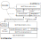

# Abstract Architecture

In this page the overall **HWoDT Abstract Architecture** is presented. \
It is a purely logical architecture that can help to describe the internal responsibilities of each role (DTs and WoDT Platform). \
*Therefore it is not mandatory and instead is here to help HWoDT developers both to understand the Framework better and to design and implement new HWoDT Adapters for unsupported technologies.*

## WoDT Digital Twin
**`Digital Twin / Digital Twin Builder`**: this component represents the **real technology used to implement the Digital Twin**.
Different DT devolpment frameworks or platforms can be used at this level e.g., Eclipse Ditto, Azure Digital Twins.
Depending on the technology it can host either just one or multiple DTs. The latter case implies that other components 
of the architecture must account for the all the underlying DTs (that need to be exposed as WoDT DTs).

**`WoDT Shadowing Adapter`**: this component **extends the existing shadowing process** of the DT layer below by adapting the existing DT to
the Web of Digital Twins metamodel, creating a semantic domain-oriented representation that is stored on the `DTKG Engine` to serve upper components. 
Moreover, it is supported by the `DT Event Dispatcher` and the `DT Action Queue` for the management of events and actions.

**`DTD Manager`**: this component **creates and manages the Digital Twin Description** of the DT(s) to expose as WoDT DT(s).

**`DTKG Engine`**: this component **manages the Digital Twin Knowledge Graph (DTKG)** of the WoDT DT(s). 
If the HWoDT Adapter supports memorization, then at each new update the past version is stored in the `DTKG Store`.

**`DTKG Store` [optional]**: this component **stores the past versions of the DTKG** to be exposed via the *Memento* protocol.

**`DT Event Dispatcher & DT Action Queue` [optional]**: these components support the `WoDT Shadowing Adapter` by **respectively dispatching events** to be exposed by the DT and **enqueuing action invocation requests** to be shadowed on the PA.

**`Platform Management Interface`**: this component **is in charge of handling the registration process to WoDT Platforms**.
It has several responsibilities:
1.  managing the automatic registration to the interested WoDT Platforms
2.  exposing
the registration notification endpoint 
3.  dispatching the DTD update and DT removal notifications to the WoDT
Platforms.

**`WoDT Digital Twin Interface`**: this components **exposes the WoDT DT interaction patterns**.

## WoDT Platform
**`Ecosystem Management Interface`**: this component **manages the registration, update, and deletion of the WoDT DTs inside the ecosystem**. 
To serve its responsibilities it additionally validate the DTDs and notify the externally added WoDT DTs.

**`WoDT Digital Twins Observer`**: this component **handles the DTKG observation** of the registered WoDT DTs. The received DTKGs are then incorporated into the DT ecosystem KG.

**`Ecosystem Registry`**: this componet **tracks the registered WoDT DTs** and is responsible for the **URI mapping logic**.

**`Platform Knowledge Graph Engine`**: this component **manages the DT ecosystem KG** handling the continuous merging process of the DTKGs and of the DTDs, as well as the data deletion of removed DTs. Moreover, the engine **resolves SPARQL queries and data requests**.

**`WoDT Platform Interface`**: this component **exposes the WoDT Platform interaction patterns** for ecosystem-level services.
