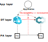

# How do we provide interoperability?
This section describes how the HWoDT vision provide interoperability in DT ecosystems.

## Heterogeneity as an advantage
The **Hypermedia-based Web of Digital Twins** goal is to streamline the design and the creation of Digital Twins ecosystems starting from existent Digital Twins, developed with heterogeneous technologies. HWoDT does not propose another framework to build Digital Twins (*it is not a silver bullet*), but its approach is orthogonal: ***provide interoperability over an heterogeneous world following the DT-as-a-service paradigm***.

This objective is aligned with the needs in open systems, where each part can be developed by a different stakeholder (e.g., [UK National Digital Twin programme](https://www.gov.uk/government/collections/the-national-digital-twin-programme-ndtp)). \
Real, open, and distributed systems distributed scenarios distinguish themselves by their heterogeneity in any dimension. In particular the presence of several Digital Twin development platforms results in *technological heterogeneity* that can imply also *metamodel heterogeneity*.

A crucial choice is to see heterogeneity as an advantage that enables the reuse of existing resources already effective within domains. However, simply composing ecosystems by DTs of different technologies is not sufficient. Indeed, it is impossible to mirror Physical assets relationships (due to differences in metamodels and interfaces) and Consumers cannot navigate in the Digital Twin layer exploiting them. Different interfaces, the absence of descriptions, and different endpoints force us to use out-of-band information and to be aware of the underlying technology.

  

## An hypermedia-based approach for engineering ecosystems of interoperable DTs
HWoDT creates an interoperability layer on top of existing DTs for the creation of ecosystems of heterogeneous DTs. As discussed above, we have two main type of heterogeneity: the *metamodel* and the *technological* ones. \
To cope with metamodel heterogeneity, a general-purpose metamodel is crucial. **Web of Digital Twins** metamodel is then choosen, forcing each DT to map its model to the WoDT metamodel, even at the cost of losing information. Remeber, that each DT will remain accessibile so, if needed, a Consumer that is technology-aware maintain access to the underlying information and services.

To enable the DT-as-a-service vision providing technological-hiding we defined a uniform interface each DT must implement (usually implemented in a HWoDT Adapter for the DT technology at hand). REST is consolidated as an enabler of the information-hiding principle, so we have chosen to create an additional layer internal or external to DTs that exposes a REST-based uniform interface. \
Our strategy is to simply map REST constraints to our scenario by exploiting Web technologies, paradigms, and protocols.

Therefore, interoperability is enabled only by the DTs themselves, which expose a uniform interface, following the DT-as-a-service perspective. The ecosystem abstraction provides a boundary of consistency for ecosystem-wide services leveraging the DTs’ interfaces to build it.

We name this proposal the **Hypermedia-based Web of Digital Twins (HWoDT)**, to emphasize the hypermedia-driven nature of the approach, following the HATEOAS principle of the REST architectural style.

## Digital Twins Uniform Interface
To create a REST-based uniform interface we need to map its constraints to HWoDT. In particular: 1) identification of resources, 2) manipulation of resources through representations, 3) self-descriptive messages, and 4) hypermedia as the engine of the application state (HATEOAS).

### Identification
A DT mirrors a PA, so they both need to be clearly identified. \
In our approach, a PA is identified with a domain-specific identifier that is not necessarily global, but it must be unique in its domain of interest. \
A DT is instead identified for its whole lifecycle by an *URI*, that allows to uniquely identify a DT globally. Therefore, different URIs mean different DTs and viceversa.

### Semantic representations
A HWoDT DT exposes two forms of representations as part of its uniform interface:
- **Digital Twin Description**: contains a static semantic description of DT’s metadata, DT model, exposed interaction patterns, and so on. It is fundamental for the automatic processing of Digital Twins. The content of the DTD depends only on the DT model and interface, so it does not depend on DT current state (or DTKG).
- **Digital Twin Knowledge Graph**: models the current state of the DT through an RDF-based Knowledge Graph expressed with the reference ontologies for the domain of interest. It models the current property values, the available actions, and the relationship instances. This enables a Consumer to navigate in a domain-oriented representation of the world.

When a DT URI is dereferenced returns the DTKG, enabling navigation in the current state of the world following DT relationships, compatibly with [*Linked Data Principles*](https://www.w3.org/DesignIssues/LinkedData.html).

### Interaction patterns
To be HWoDT-compliant, a DT must expose the following interaction patterns:
- *Accessing DT Data*: an HTTP GET request on the DT URI returns a 303 Status code (considering that the DT is a [*non-information resource*](https://www.w3.org/TR/cooluris/)) with the `Location` HTTP Header set to the URL of the DTKG. \
An HTTP GET request on the DTKG URL returns a serialization of the DTKG with an HTTP Link Header with relation type `dtd` pointing the URL where the DTD is served. \
This strategy is aligned with *Linked Data Principles* supporting navigability and discoverability of the two types of representation. \
Finally, if the DT supports memorization it can also serve DTKG historic data using the [*Memento Protocol*](https://doi.org/10.17487/RFC7089), acting as a TimeGate.
- *Observation*: the DTKG updates over time to reflect DT state. DTs provide a mechanism to subscribe to DTKG changes e.g., through WebSockets, HTTP long-polling or WebSub.
- *Action invocation*: the DTKG lists the available actions depending on the current state, the DTD instead describe the interaction affordances for each possible actions. A consumer should be able, processing both representations, to select from the available actions and request their invokation on the DT. The invokation of actions that are not available should safely fail.

## Ecosystems of interoperable Digital Twins
The WoDT Platform is the HWoDT centralized approach to offer services for Consumers at the DT ecosystem level. The platform aggregate data from the registered DTs and exposes an interface consumers can use to interact with the ecosystem as a whole.

DTs can become part of an ecosystem by submitting the corresponding DTD (i.e. with a POST request to the WoDT Platform) either:
- automatically configuring the DT to join some targets WoDT Platform at the startup;
- manually by the administrator of the WoDT Platform. In this case the WoDT Platform will notify the interested DT. For this reason the DT must accept an HTTP POST request at the `<dt_uri>/platform` endpoint.

After a DT is registered, the WoDT Platform process the DTD to fecth the interaction pattern endpoint for the DTKG observation.
The DT ecosystem Knowledge Graph is built by the WoDT Platform by the continuous process of aggregating both DTKGs and DTDs from the registered DTs. Hence, both state and metadata are merged to enable more powerful queries that can retrieve both DT state and its metadata. \
Moreover, the DT ecosystem KG acts as a local cache that Consumers can exploit. DT URIs are translated to URLs that point to the cached version, allowing navigation within the cache.

Obviously, DTs can remove themselves or be removed from a DT ecosystem with an HTTP DELETE request on the WoDT Platform at the DT mapped URL.

The creation of the DT ecosystem KG enables the WoDT Platform to offer services at the DT ecosystem level:
- *Snapshot of the DT ecosystem KG*: an HTTP GET request on the WoDT Platform URI returns a 303 Status code (considering that the ecosystem is a [*non-information resource*](https://www.w3.org/TR/cooluris/)) with the `Location` HTTP Header set to the URL of the DT ecosystem KG.
- *Cached DT snapshot*: an HTTP GET request on the mapped URL returns the DT's DTKG local cache on the WoDT Platform. The response has an HTTP Link Header with relation type `original` to allow Consumers navigate to the original DT.
- *SPARQL Query on the DT ecosystem KG*: the WoDT Platform exposes a [SPARQL endpoint](https://www.w3.org/TR/2013/REC-sparql11-protocol-20130321/) to make read-only queries. An HTTP POST request with the SPARQL query in the request body (compatibly with the [SPARQL protocol](https://www.w3.org/TR/2013/REC-sparql11-protocol-20130321/)) allows consumers to perform SPARQL queries over the DT ecosystem Knowledge Graph.
- *Observation of the DT ecosystem KG*: it is possible to observe the evolution of the DT ecosystem KG.
- *Catalog service*: provides a catalog of all currently registered DTs to the ecosystem. 
- *Directory service*: provides an efficient way to search for DTs that are associated to a specific PA, starting from the PA ID. This service allows Consumers to consult different representations of
the same PA within the same ecosystem.

:page_facing_up: ***For further details please refer to the [publications](https://web-of-digital-twins.github.io/academia/).*** :page_facing_up:
