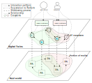

# HWoDT Overview

This section is beneficial for gaining a high-level understanding of the **Web of Digital Twins (WoDT)** and of the **Hypermedia-based WoDT** proposal. \
Following a short overview, an example based on the *Major Trauma Management* use case is presented.

## About Web of Digital Twins and HWoDT

### What are Digital Twins?
**Digital Twins (DT)** are becoming very popular in Internet of Things (IoT) and Chyber-Physical Systems (CPS). The main idea behind Digital Twins is to create *virtual* representations of physical assets (PAs) living in the *physical world* and maintain their digital copies synchronized through a *continuous connection* called *shadowing* process [[Giulianelli et al.](https://doi.org/10.1145/3652620.3688263)]. \
Applications, and in general Consumers, can access Digital Twins to monitor and act the associated physical asset directly at the digital level, leveraging the advantages of software dematerialization.

### What is the WoDT?
Recent trends envision technologies and metamodels supporting ecosystems of interconnect DTs mirroring the portion of the real world of interest. These proposals differ from the siloed and domain-specific ones focused on the representation of individual, standalone assets with highly-specialized metamodel tailored to the application domain. While the latter can surely support organizations in making well-informed decisions, often CPS deal with dynamic interconnected assets. Therefore, the *DT ecosystem* abstraction is useful to drive more informed, scalable and capable systems.

The idea of a **Web of Digital Twins (WoDT)** [[A. Ricci et al.](https://doi.org/10.1145/3507909)] enrich the *DT ecosystem* abstraction conceiving it as an open, distributed, and dynamic ecosystem of connected DTs, functioning as an interoperable service-oriented layer for applications. Central to this approach is the idea of *DT-as-a-service* with each DT independently mirroring a specific asset in the real world and offering its capabilities to external consumers. \
The WoDT defines a general-purpose metamodel used to represent each DT:
- *Properties*: represent observable attributes of the PA;
- *Relationships*: reflect the connections between PAs as links between DTs;
- *Actions*: represent the available actions that can invoked to control or influence the state or the behaviour of the PA, sending commands to it through the corresponding DT;
- *Events*: represent events of interest originated from an update of the PA.

Hence, the **WoDT** is a dynamic set of indipendent DTs, each one with its model and state, linked according to the relationships between PAs that are reifed in the digital world.

### Why the HWoDT proposal and Framework?
The wide applicability of the DT paradigm led to the creation of several technologies eg., [Azure Digital Twins](https://azure.microsoft.com/en-us/products/digital-twins), [AWS IoT TwinMaker](6https://aws.amazon.com/iot-twinmaker/) [Eclipse Ditto](7https://eclipse.dev/ditto/index.html).

This technological heterogeneity must be considered to actually design and implement DT ecosystem, especially when they are created over legacy software or by including existing DTs -- that could be still needed for other consumers. With different technologies, Consumers need to be aware of the underlying stack to use the required API or SDK at hand. This could be problematic in the long-term, especially for highly dynamic ecosystems. So, the need for technological-hiding and for an uniform interface that enable applications to access the DTs within an ecosystem arise.

The ***Hypermedia-based WoDT (HWoDT)*** [[Giulianelli et al.](https://doi.org/10.1145/3652620.3688263)] aims to extend, implement and deploy the WoDT vision exploiting the Web standards, technologies, and the REST architectural style to achieve interoperability and openness in ecosystems of heterogeneous DTs. The core idea is to hide the heterogeneity of DTs behind a uniform interface based on Web protocols and standards as well as an explicit semantic layer that allows DTs to provide a uniform description of both their state and their features. The HWoDT uniform interface supports the creation of DT ecosystems from new or existing DTs regardless of the technology stack, *without losing the ability to interact directly with the DT*. \
This makes the approach particularly suitable for open systems, where the development of DTs may be performed by different stakeholders with different purposes, while still adopting a uniform shared interface for interoperability sake.

The DT-as-a-service paradigm is central also in the HWoDT vision. The interoperability is enabled by each single DT by exposing the HWoDT uniform interface that enable to access them as a service, provind technological hiding. \
To support the management and to define a scope boundary for the operations on the DT ecosystems that enable consumers to query, observe, and exploit services we introduce the idea of a **WoDT Platform**. As the WoDT platform maps to an ecosystem, we believe in the possibility of having multiple platforms, possibly sharing DTs to compose different views and accommodate different kinds of applications. To participate in a DT ecosystem, DTs are registered or register themselves to the interested platforms.

The scheme depicts the HWoDT idea. Physical Assets, from different domain and organizations, are connected by relationships in the real world that are reified as relationships among the DTs mirroring them. DT ecosystems are built from DTs of different technologies with the support of the WoDT Platform instances. Consumers and applications reason over the digital replica of the portion of the reality by interacting either with the individual DTs (independently of the underlying technology thanks to the uniform interface) or with the whole ecosystem through the Platform.

For further details please refer to the [paper](https://doi.org/10.1145/3652620.3688263).
