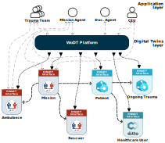

# Quick start by examples
The HWoDT Framework is designed to streamline the creation and management of interoperable DT ecosystems, starting from existing DTs implemented with heterogeneous technologies. \
The best way to understand the goals and the advantages of the **HWoDT** is to directly deep dive in a running example. \
This page is very brief and contains the pointers to ready-to-play use cases which you can directly test on your local environment.

## The Major Trauma Management case study
**[GitHub repository](https://github.com/Web-of-Digital-Twins/major-trauma-management-case-study)**

We follow the *Major Trauma Management* case study described in [[A. Ricci et al. _Web of Digital Twins_](https://dl.acm.org/doi/10.1145/3507909)]. \
Trauma management is among the most challenging scenarios in the healthcare context due to its time-dependent nature, making DTs highly relevant for this scenario.
Our objective is to apply the *HWoDT Framework* to the first two stages of the process: 
- the *Emergency Call Management*: where the Central Emergency Unit receives and manage a first-aid emergency mission, and
- the *Pre-Hospital Management*: which encompasses the time from when a rescuer first arrives on the scene and starts treating a patient to when that patient is taken to a trauma center.

The healthcare sector is characterized by a strong technological heterogeneity, representing a perfect testboard for our framework.

From this use case example we want to demonstrate:
- the feasibility of conceiving the DT-as-a-service vision through a uniform interface that hides the underlying technology;
- the straightforward and uniform navigability in the resulting DT ecosystems;
- the feasibility of ecosystem-level services, especially concerning queries across the whole DT ecosystem.

Follow the instructions described in the dedicated **[GitHub repository](https://github.com/Web-of-Digital-Twins/major-trauma-management-case-study)**.
